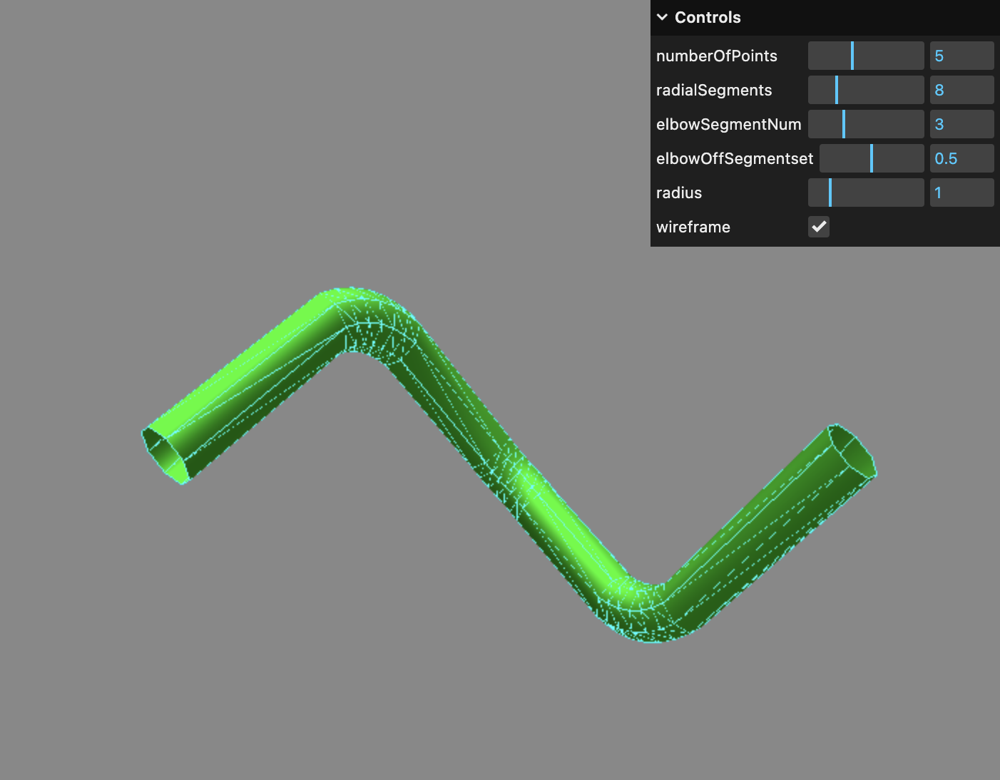

# three-tube-path
TubeGeometry for three.js with just as many tubular segments as needed.


## Usage
```js
import { TubePath } from 'three-tube-path';
const path = new THREE.CatmullRomCurve3([new THREE.Vector3(-5, -5, 0), new THREE.Vector3(-5, 5, 0), new THREE.Vector3(5, 5, 0)]);
const geometry = new TubePath(path, TubePath.pathToUMapping(path, 3, 0.3), 1, 8, false);
const tube = new THREE.Mesh(geometry, new THREE.MeshStandardMaterial({ color: 'green' }));
scene.add(tube);
```

## Install
```sh
npm install three-tube-path --save
```

## Demo
https://erasta.github.io/three-tube-path



## License

MIT, see [LICENSE](http://github.com/erasta/three-tube-path/blob/master/LICENSE) for details.